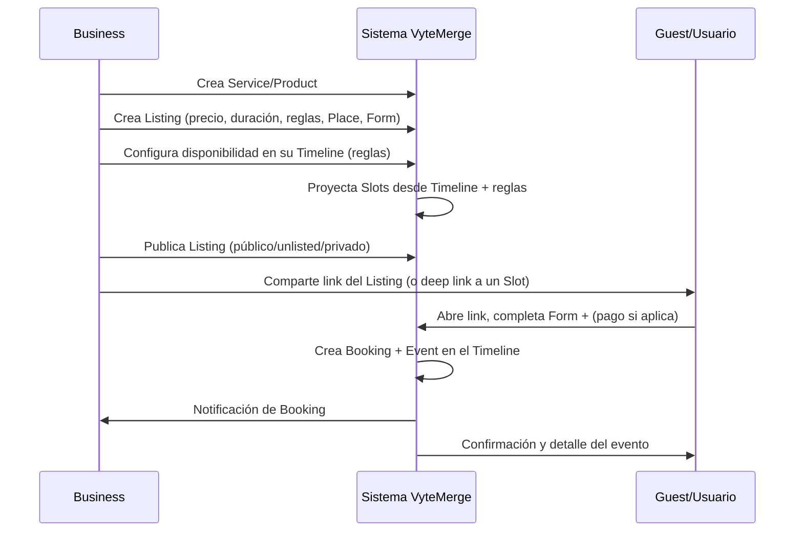
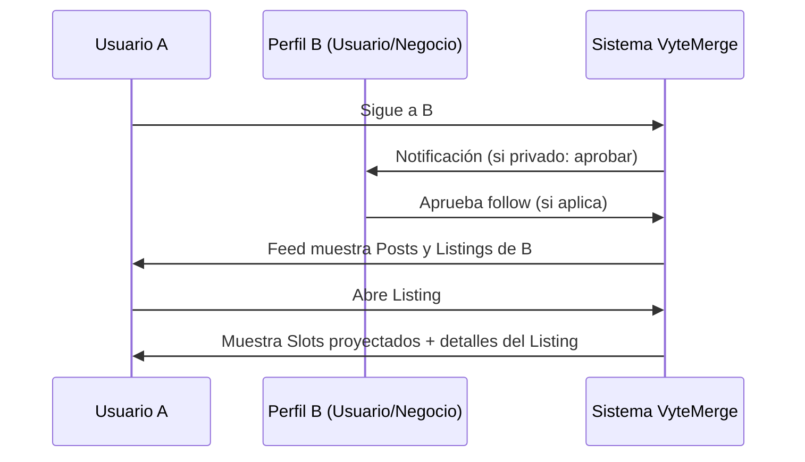

Diego test
# ¿Qué es VyteMerge?

## Overview
VyteMerge es una plataforma social de **Smart Booking + Marketplace + Social Graph**, diseñada para reemplazar el calendario clásico por una **vista de Timeline** (tipo *git merge*).  
Permite a **usuarios** organizar su tiempo y descubrir **listings**, y a **negocios** optimizar su ocupación y promocionar **listings** mediante campañas.

**Modelo mental (4 piezas):**
- **Service/Product** = qué se ofrece (catálogo reusable)
- **Timeline** = cuándo (agenda / fuente de verdad del tiempo)
- **Listing (Listado)** = cómo se ofrece/vende un Service/Product (promocionable)
- **Place (Lugar)** = dónde ocurre (ubicación + zona horaria)

> Nota: **Slot** es disponibilidad *proyectada* (derivada), no la fuente de verdad. La confirmación real sucede con **Booking**.

---

## 1. Visión
Ser la **plataforma social de referencia** para agendar y descubrir servicios, donde el timeline personal se convierte en el eje de interacción:
- Agenda → **Events, Slots (proyectados) y Bookings**
- Social → **Follows, Profiles, Posts**
- Comercial → **Marketplace + Campaigns (sobre Listings)**

---

## 2. Valor
- **Usuarios**:
  - Gestionan agenda personal y familiar desde Timelines.
  - Descubren y reservan **listings** relevantes a su disponibilidad.
  - Controlan privacidad en cuenta, timeline y slots.

- **Negocios**:
  - Publican **services** y **listings** en segundos.
  - Llenan huecos de agenda gracias a recomendaciones y campañas.
  - Obtienen métricas (utilización, conversión, campañas, seguidores).

---

## 3. Módulos Principales
1. Users (upgrade a Business)
2. Profiles
3. Timelines
4. Services & Products (Catálogo)
5. Listings (Listados)
6. Slots & Bookings
7. Places
8. Dynamic Forms (Intake)
9. Channels (Chat)
10. Notifications
11. Suggest (Feed & Recommendations)
12. Social Graph (Follow)
13. Search & Discovery
14. Access (Privacy enforcement)
15. Agreements (delegación / sharing)
16. Tags
17. Business Dashboard & Campaigns
18. Admin Panel

---

## 4. Flujos de Ejemplo

### 4.1 Publicar un Listing y recibir un Booking

### 4.2 Seguir y Descubrir Listings / Posts

---

## 5. MVP (Phase 1)
- Users (upgrade a Business)
- **Smart Booking básico** (services/listings/slots/bookings)
- Places
- Timelines
- Social básico (follow, profiles, posts)
- Suggest (Feed & Recommendations)
- Search & Discovery
- Admin Panel (básico)

---

## 6. KPIs Iniciales
- **Utilización**: minutos reservados / minutos disponibles (por Timeline)
- **Conversión Listing→Booking**
- **Conversión Slot→Booking**
- **Crecimiento de seguidores**

---

## 7. Glosario VyteMerge
| Término | Definición |
|---|---|
| **Timeline** | Vista cronológica e infinita que centraliza events y bookings; puede combinar varios timelines (similar a *git merge*). |
| **Event** | Hecho en el tiempo (manual o derivado de un Booking). |
| **Slot** | Franja horaria de disponibilidad **proyectada** a partir de reglas + Timeline; se usa para explorar y reservar. |
| **Booking** | Reserva/confirmación asociada a un Listing y a un Slot; puede estar pendiente o confirmada. |
| **Service/Product** | Definición reusable de lo que se ofrece/vende (duración base, descripción, etc.). |
| **Listing** | Publicación comercial del Service/Product con precio, reglas, Place, Form, capacidad y políticas; es lo que se promociona con Campaigns. |
| **Place** | Ubicación y zona horaria del evento/servicio (físico o virtual). |
| **Campaign** | Estrategia de promoción pagada que aumenta la visibilidad de **Listings** en el marketplace y feeds. |
| **Profile** | Página pública o privada de un usuario o negocio con bio, enlaces y publicaciones. |
| **Follow** | Relación social para ver contenido/actividad de otro perfil (puede requerir aprobación). |
| **Post** | Contenido corto publicado en un perfil o timeline; puede vincularse a un Listing. |
| **Form (Intake)** | Formulario dinámico que recopila información al momento de reservar. |
| **Privacy** | Configuración de visibilidad granular (cuenta / timeline / slot). |
| **Marketplace** | Espacio donde se descubren Listings y se ejecuta la compra/reserva. |
| **Business Dashboard** | Panel para métricas, gestión de campañas y performance comercial. |
