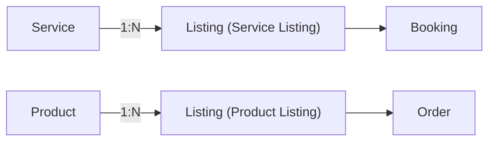
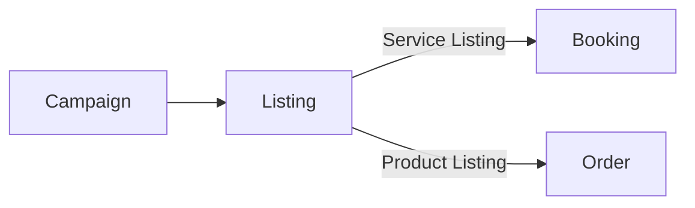

# Relationships (Service/Product ↔ Listing ↔ Booking/Order)

## TL;DR
- **Service** = dominio operativo (duración, precio base, buffers, form, policy)
- **Product** = definición de producto (nombre, media, tags)
- **Listing** = dominio comercial/discovery (copy, media, canales, promo, modificadores de precio)
- **Booking / Order** = transacción (lo que realmente ocurrió, con snapshot)
- **Campaigns** promocionan **Listings**
- **Agreements + Access** determinan *quién puede ver/hacer qué*

---

## Relación principal

---

## ¿Dónde vive cada regla? (v1)

| Tipo de regla | Service | Listing | Otro |
|---|---|---|---|
| Nombre y descripción operativa | ✅ | override de copy comercial | — |
| **Duración base** | ✅ fuente de verdad | puede ajustar (express, grupal) | — |
| **Precio base** | ✅ fuente de verdad | aplica modificadores | — |
| **Modificadores de precio** (discount, bundle) | — | ✅ | — |
| **EffectivePrice snapshot** | — | — | ✅ Booking/Order |
| **Buffers pre/post** | ✅ | — | — |
| **Formulario de intake (intakeForm)** | ✅ | — | — |
| **Política de confirmación** | ✅ | — | — |
| **Location operativa** | ✅ referencia | puede especificar alternativa | — |
| **Media (fotos/videos)** | ❌ no aplica | ✅ dueño de la media | — |
| Copy de marketing / descripción promo | — | ✅ | — |
| Tags de discovery / categoría comercial | — | ✅ | — |
| Visibilidad / canales / distribución | — | ✅ | Access + Channels |
| Scheduling, slots, disponibilidad | — | reglas del listing | ✅ Timeline + Conflict Rules |
| Conflictos (qué bloquea la agenda) | — | — | ✅ Timeline Conflict Rules |
| Capacity pool / staff assignment | — | ✅ | — |
| BookingCapacity, MinToConfirm, Attendees | — | reglas | ✅ Booking (instancia) |
| Términos de la oferta puntual | — | ✅ Listing Terms | — |
| Términos de plataforma | — | — | ✅ Platform Terms |
| Visibilidad / permisos | — | — | ✅ Access + Agreements |

### Nota sobre Product vs Service (media)
- **Product**: mantiene `baseMedia` como fallback si el Listing no tiene media propia.
- **Service**: **no almacena media**. El Listing es siempre dueño de la media.

Esta diferencia es intencional: Product es un objeto de catálogo visual;
Service es una definición operativa.

---

## Separación conceptual (por qué es valiosa)

### Reutilización
Un mismo Service puede venderse de muchas formas sin duplicarlo:
- Service "Masaje" → Listing estándar, Listing express, Listing promo 2x1
- `basePrice` definido en Service; cada Listing aplica su modificador

### Evolución sin romper histórico
- Cambios en Service → no afectan Bookings existentes (snapshot protege)
- Cambios en Listing → no afectan Bookings existentes (snapshot protege)

### Reporting más real
- Performance por Listing (oferta puntual)
- Demanda agregada por Service (tipo de servicio)
- `EffectivePrice` por Booking para revenue real

---

## Bookings vs Orders (regla mental)
- **Booking** = transacción de **tiempo** (reservar un slot/turno de un Service Listing)
- **Order** = transacción de **productos** (comprar ítems de un Product Listing)

> En el futuro pueden combinarse (ej: service + producto add-on), pero siguen siendo conceptos distintos.

---

## Campaigns
Las **Campaigns promocionan Listings** (no Services/Products directamente):

**Por qué:**
- El Listing es lo que el usuario ve y acciona ("Reservar", "Comprar")
- La media y el copy para la campaña viven en el Listing
- La Campaign empuja distribución (feed/search/placements)

---

## Agreements + Access

Agreements y Access no "cambian" las relaciones, pero determinan **si** y **cómo** el actor puede interactuar.

Ejemplos:
- Listing Public, pero actor está bloqueado → no ve nada (`VisibilityMode.None`)
- Listing PartnerOnly → requiere Agreement activo
- Staff interno para assignment, pero Listing puede ocultar identidad al cliente

---

## Checklist
- [ ] Cada Listing referencia un Service o Product
- [ ] Service no almacena media (media → Listing)
- [ ] `Service.basePrice` es la fuente de verdad; Listing aplica modificadores
- [ ] Booking/Order guardan snapshot (precio, terms, forms) al confirmar
- [ ] Campaigns apuntan a Listings
- [ ] Access decide visibilidad en todos los puntos de entrada
