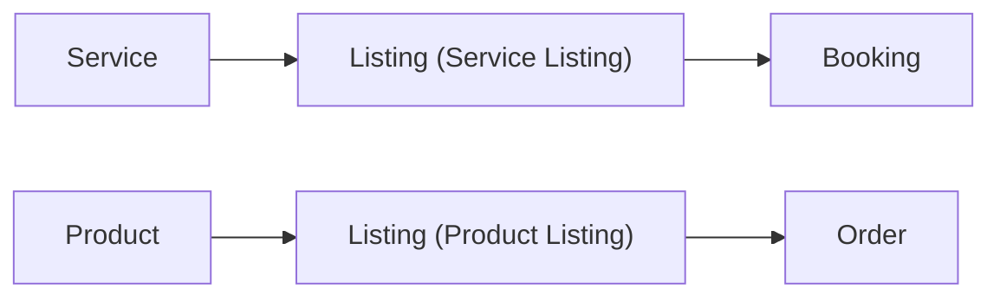
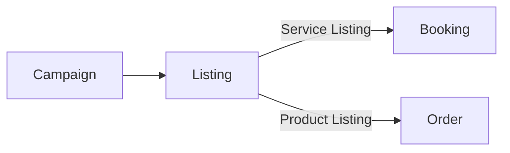

# Relationships (Service/Product ↔ Listing ↔ Booking/Order)

## TL;DR
- **Service / Product** define *qué es* (definición reusable)
- **Listing** define *cómo se ofrece/vende* (precio, reglas, distribución, scheduling)
- **Booking / Order** son la transacción (lo que realmente ocurrió)
- **Campaigns** promocionan **Listings**
- **Agreements + Access** determinan *quién puede ver/hacer qué*

---

## Relación principal

---

## Separación conceptual (por qué es valiosa)

### Reutilización
Un mismo Service/Product puede venderse de muchas formas sin duplicarlo:
- Service “Masaje” → Listing estándar, Listing express, Listing promo 2x1
- Product “Shampoo” → Listing regular, Listing pack x3, Listing canal VIP

### Experimentos sin caos
Probás promos/canales/campaigns sin tocar el “qué”:
- cambia el Listing, no el Service/Product

### Reporting más real
Podés medir:
- performance por Listing (oferta)
- demanda agregada por Service/Product (tipo de cosa)

### Evolución del producto
Te deja crecer:
- agregar Orders sin tocar Bookings
- agregar bundles/add-ons sin reinventar el catalog

---

## ¿Dónde vive cada regla?
| Tipo de regla | Vive en |
|---|---|
| Definición del servicio/producto (qué es) | **Service / Product** |
| Presentación comercial (título, copy, media promo) | **Listing** (con fallback a Service/Product) |
| Precio, promos, políticas comerciales | **Listing** |
| Scheduling y slots | **Listing + Timeline + Conflict Rules** |
| Conflictos (qué cuenta como conflicto) | **Timeline (Conflict Rules)** |
| DZ / ubicación del servicio (dónde) | **Place** (referenciado por Listing/Booking/Event) |
| Capacity pool / staff assignment | **Listing** (y su relación con staff/agreement) |
| BookingCapacity, MinToConfirm, Attendees | **Listing** (reglas) + **Booking** (instancia) |
| Formularios (datos requeridos) | **Listing → Forms** + snapshot en Booking/Order |
| Términos de venta (esta oferta puntual) | **Listing Terms** (y Agreements si aplica) |
| Visibilidad/permisos | **Access + Agreements** |
| Pagos/compra de producto | **Order** (y el checkout) |

---

## Bookings vs Orders (regla mental)
- **Booking** = transacción de **tiempo** (reservar un slot/turno)
- **Order** = transacción de **productos** (comprar ítems)

> En el futuro pueden combinarse (ej: service + producto add-on), pero siguen siendo conceptos distintos.

---

## Campaigns
Las **Campaigns promocionan Listings** (no Services/Products directamente):

**Por qué**
- el listing es lo que el usuario ve y acciona (“Reservar”, “Comprar”)
- la campaign empuja distribución (feed/search/placements)

### Reporting recomendado
- Métricas por Campaign → por Listing
- Agregación opcional por Service/Product para entender demanda real

---

## Agreements + Access (cómo atraviesan todo)
Agreements y Access no “cambian” las relaciones, pero determinan **si** y **cómo** el actor puede interactuar.

Ejemplos:
- Listing Public, pero actor está bloqueado → no ve nada (`VisibilityMode.None`)
- Listing PartnerOnly → requiere Agreement activo
- Staff interno existe para assignment, pero el listing puede ocultar identidad del staff al cliente

---

## Checklist
- [ ] Cada Listing referencia un Service o Product
- [ ] Booking/Order guardan snapshot (precio, terms, forms) para histórico
- [ ] Campaigns apuntan a Listings
- [ ] Access decide visibilidad y permisos en todos los puntos de entrada (feed/profile/detail)
