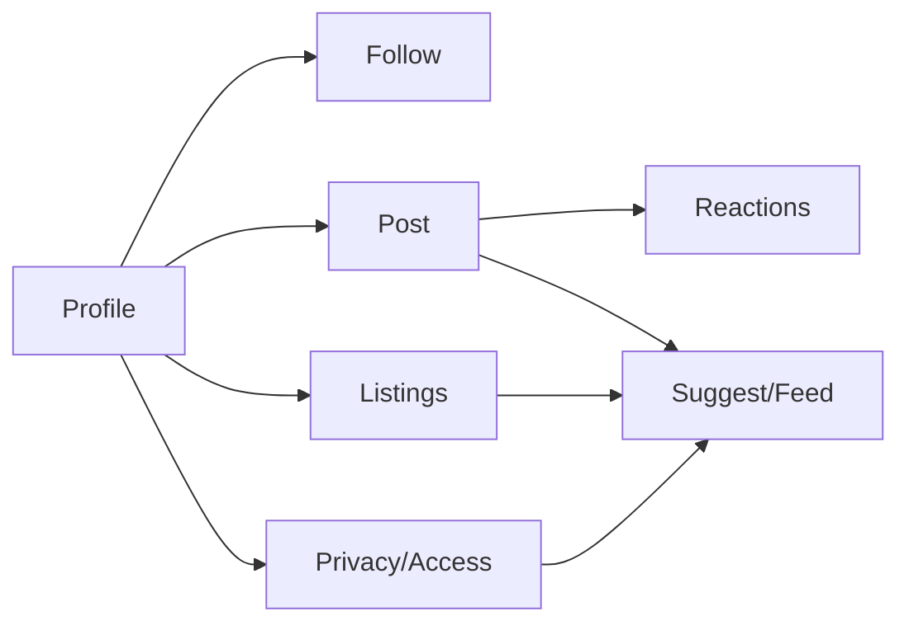

# Social (Overview)

## Context/Goal
Este módulo define la **capa social** de VyteMerge: **quién sigue a quién**, **qué contenido se publica**, **cómo se interactúa** (likes/reactions) y **cómo se ve un Profile**.
El objetivo es tener un sistema social **coherente con el Core Model** y con **Privacy/Access** como enforcement final.

## Scope
Incluye:
- **Profile** (identidad social y su presentación)
- **Follow** (Social Graph: follow request/approve, mute, block)
- **Post** (publicación de contenido social; puede referenciar Listings)
- **Reaction** (like/reactions)
- Reglas de visibilidad y moderación mínima (report, block)

No incluye (por ahora):
- Comentarios (fase 2)
- Reposts/Shares avanzados (fase 2)
- Mensajería 1:1 (vive en Channels/Chat)
- Ranking profundo del Feed (vive en Suggest; aquí se define **qué es elegible**)

## Modelo mental (loop social)
1) Un **Profile** publica un **Post** (y/o crea **Listings**).
2) Otros Profiles hacen **Follow** y ven contenido en **Feed**.
3) Interactúan con **Reactions** (engagement).
4) El sistema personaliza Suggest/Feed (sin romper **Privacy**).

## Integraciones con otros módulos
- **Access / Privacy**: decide la visibilidad final (perfil privado, posts followers-only, unlisted, etc.).
- **Suggest / Feed**: consume Posts/Listings elegibles y aplica ranking.
- **Listings**: un Post puede referenciar un Listing (ej: “turnos disponibles”).
- **Channels**: (opcional) publicar a una audiencia específica.

## Principios de diseño
- **Simple primero**: follow, post, like/reaction; sin complejidad innecesaria.
- **Privacy by default**: lo privado no “se filtra” por feed/recomendaciones.
- **Objetos separados**: Post es social; Listing es comercial; pueden vincularse.
- **Acciones en 1–2 pasos**: seguir, reaccionar, guardar, reservar (cuando aplica).

## KPIs del módulo social
- Crecimiento de **followers**
- Engagement: **reactions/post**, CTR de cards
- Conversión social→comercial: Post→Listing→Booking
- Retención: usuarios activos semanales (WAU), posts activos/día

## Open Questions
- ¿MVP incluye publicar Posts en **Channels** o solo en Profile?
- ¿Qué metadata mínima se muestra en Profiles privados (sin follow)?
