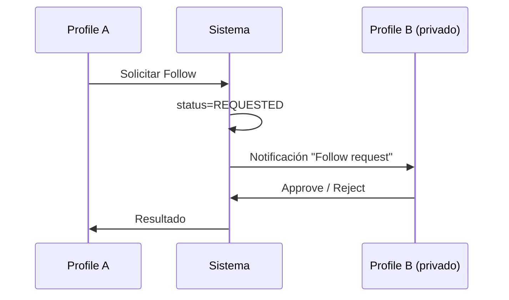

# Profiles

## Context/Goal
Definir cómo se presenta un **Profile** (persona u organización) y qué capacidades sociales expone: follow, posts, listings, enlaces y señales de confianza.

## Scope
Incluye:
- Vista pública y privada
- Secciones/tabs del perfil
- Estados de CTA (Follow / Requested / Following / Blocked)
- Diferencias Persona vs Organización (Business)

No incluye:
- Configuración de Access/Agreements (vive en Access/Agreements, acá solo se referencia)
- Dashboard de negocio (vive en Business Dashboard)

## Componentes del Profile (UI)
### 1) Header
- Avatar + Cover (opcional)
- `displayName` + `handle`
- Badges: **Business** (MVP), **Verified** (futuro)
- CTA principal:
  - Follow / Requested / Following
  - Message (si existe canal permitido)
  - Book (si tiene Listings publicables)

### 2) Resumen (bio + links)
- Bio corta (1–3 líneas) + “ver más”
- Links: website / instagram / whatsapp / email (configurable)
- Tags/categorías (si aplica)
- Place principal o zona (opcional)

### 3) Stats
- Followers
- Following
- Posts
- (futuro) Bookings completados / rating / reviews

### 4) Tabs (recomendado)
1. **Posts** (contenido social)
2. **Listings** (cards comercial: reservar / comprar)
3. **About** (bio extendida, places, horarios, categorías)
4. (opcional) **Highlights** (posts fijados / top listings)

## Estados del Profile (privacidad)
### Profile público
- Se ve todo lo que sea `PUBLIC` y lo que Access permita.
- Follow inmediato.

### Profile privado
- Sin follow:
  - Mostrar header mínimo + “Este perfil es privado”
  - CTA: “Solicitar seguimiento”
  - Ocultar tabs de Posts/Listings (o mostrar bloqueados)
- Con follow aprobado:
  - Se habilita `FOLLOWERS` + lo que Access permita.

> Principio: Privado ≠ invisible. Mostrar metadata mínima mejora confianza y reduce fricción.

## CTAs y comportamiento
- **Follow**:
  - Public: pasa a Following inmediato
  - Private: pasa a Requested
- **Unfollow**: vuelve a None
- **Mute**: mantiene Following pero excluye del feed
- **Block**: corta toda interacción y visibilidad bilateral

## Flujos
### Solicitud de seguimiento (perfil privado)

## Edición del propio perfil (BL-233)

El propio dueño puede editar `displayName`, `bio`, `isPrivate` y subir/quitar
**avatar** y **cover** desde el modal "Editar perfil" en `/profile/me`.

### Aggregate

`Profile` expone:

- `UpdateDetails(displayName, bio, isPrivate): Result` → cambia los tres
  campos atómicamente y publica `ProfileDetailsUpdatedDomainEvent`.
- `SetAvatarUrl(string?): Result` → publica `ProfileAvatarChangedDomainEvent(profileId, oldUrl, newUrl)`.
- `SetCoverUrl(string?): Result` → publica `ProfileCoverChangedDomainEvent(profileId, oldUrl, newUrl)`.

El campo `CoverUrl` (nullable, ≤500 chars) se agrega a `social.profiles` vía
migración `AddProfileCoverUrl`.

### Storage

Las imágenes se persisten al filesystem local del backend bajo
`wwwroot/media/profile/{guid}.{ext}` y se sirven públicamente en
`/media/profile/{guid}.{ext}` vía `app.UseStaticFiles()`. La abstracción
`IFileStorage` (común a todos los módulos) ya estaba establecida por el
módulo Listing; no se introduce ADR específica.

Cleanup de archivos viejos: best-effort `IFileStorage.DeleteAsync` después
de que el commit de DB tiene éxito; los fallos se loguean pero no propagan.

### Endpoints (mutación, todos `RequireAuthorization(Social.EditProfile)`)

- `PATCH /social/profiles/me` — cambia campos de texto.
- `POST /social/profiles/me/avatar` — multipart, ≤5 MB, image/png|jpeg|webp.
- `POST /social/profiles/me/cover` — multipart, ≤8 MB, mismos MIMEs.
- `DELETE /social/profiles/me/avatar` — limpia y borra archivo.
- `DELETE /social/profiles/me/cover` — análogo.

### Out of scope (deferred)

- Cropper de imagen (BL-234), `username` con uniqueness (BL-235),
  resize/re-encode server-side (BL-236), cron de limpieza de huérfanos
  (BL-237).

## Checklist de consistencia
- [ ] Los CTAs reflejan el estado real (requested/following/blocked)
- [ ] Access/Privacy siempre se aplica antes de renderizar contenido
- [ ] Listings se muestran solo si el viewer tiene permiso (public/followers/partner)
- [ ] Solo el dueño del Profile puede llamar `PATCH/POST/DELETE /social/profiles/me/*`
- [ ] El cleanup de archivos viejos no bloquea la respuesta (best-effort)
