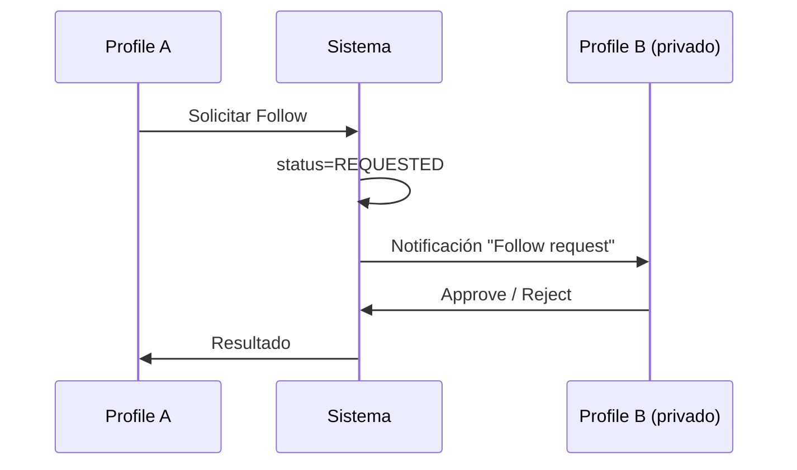

# Profiles

## Context/Goal
Definir cómo se presenta un **Profile** (persona u organización) y qué capacidades sociales expone: follow, posts, listings, enlaces y señales de confianza.

## Scope
Incluye:
- Vista pública y privada
- Secciones/tabs del perfil
- Estados de CTA (Follow / Requested / Following / Blocked)
- Diferencias Persona vs Organización (Business)

No incluye:
- Configuración de Access/Agreements (vive en Access/Agreements, acá solo se referencia)
- Dashboard de negocio (vive en Business Dashboard)

## Componentes del Profile (UI)
### 1) Header
- Avatar + Cover (opcional)
- `displayName` + `handle`
- Badges: **Business** (MVP), **Verified** (futuro)
- CTA principal:
  - Follow / Requested / Following
  - Message (si existe canal permitido)
  - Book (si tiene Listings publicables)

### 2) Resumen (bio + links)
- Bio corta (1–3 líneas) + “ver más”
- Links: website / instagram / whatsapp / email (configurable)
- Tags/categorías (si aplica)
- Place principal o zona (opcional)

### 3) Stats
- Followers
- Following
- Posts
- (futuro) Bookings completados / rating / reviews

### 4) Tabs (recomendado)
1. **Posts** (contenido social)
2. **Listings** (cards comercial: reservar / comprar)
3. **About** (bio extendida, places, horarios, categorías)
4. (opcional) **Highlights** (posts fijados / top listings)

## Estados del Profile (privacidad)
### Profile público
- Se ve todo lo que sea `PUBLIC` y lo que Access permita.
- Follow inmediato.

### Profile privado
- Sin follow:
  - Mostrar header mínimo + “Este perfil es privado”
  - CTA: “Solicitar seguimiento”
  - Ocultar tabs de Posts/Listings (o mostrar bloqueados)
- Con follow aprobado:
  - Se habilita `FOLLOWERS` + lo que Access permita.

> Principio: Privado ≠ invisible. Mostrar metadata mínima mejora confianza y reduce fricción.

## CTAs y comportamiento
- **Follow**:
  - Public: pasa a Following inmediato
  - Private: pasa a Requested
- **Unfollow**: vuelve a None
- **Mute**: mantiene Following pero excluye del feed
- **Block**: corta toda interacción y visibilidad bilateral

## Flujos
### Solicitud de seguimiento (perfil privado)

## Checklist de consistencia
- [ ] Los CTAs reflejan el estado real (requested/following/blocked)
- [ ] Access/Privacy siempre se aplica antes de renderizar contenido
- [ ] Listings se muestran solo si el viewer tiene permiso (public/followers/partner)
