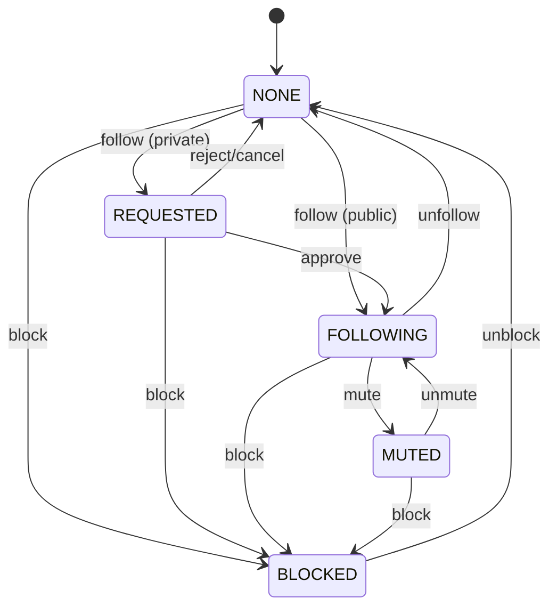

# Social Graph

## Context/Goal
Definir **quién sigue a quién** y cómo se modelan relaciones sociales: follow requests, aprobaciones, silenciar (mute) y bloquear (block).

## Scope
Incluye:
- Estados de Follow
- Reglas para perfiles públicos/privados
- Block/Mute (anti-abuso)
- Listas Followers/Following

No incluye:
- Ranking del feed (Suggest)
- Moderación avanzada (phase 2)

## Estados del Follow
- `NONE`: no hay relación
- `REQUESTED`: follow pendiente (perfil privado)
- `FOLLOWING`: follow activo
- `MUTED`: following activo pero sin aparecer en feed (para el follower)
- `BLOCKED`: bloqueo (impide ver/interactuar)

## Reglas clave
1) **Perfil público**: follow inmediato.
2) **Perfil privado**: follow crea `REQUESTED` y requiere aprobación.
3) **Block**:
   - El bloqueado no puede ver Profile, Posts, Listings, ni interactuar.
   - Se elimina cualquier follow existente (en ambos sentidos).
4) **Mute**:
   - Solo afecta el feed del follower.
   - No altera permisos ni visibilidad del perfil.

## Listas
- Followers: “quién me sigue” (viewer con permisos)
- Following: “a quién sigo”
- Requests: “pendientes por aprobar” (solo el Profile owner/delegados)

## Edge cases (decisiones)
- Mutual follow: dos edges, uno por dirección.
- Org/Business: se sigue igual que persona; UI puede mostrar badge Business.
- Private + unlisted content: unlisted se ve por link, **si no hay block** y Access lo permite.

## AC (Acceptance Criteria)
- Given profile public, when A follow, then status = FOLLOWING.
- Given profile private, when A follow, then status = REQUESTED hasta approve.
- Given B blocks A, then A no ve nada de B y no puede reaccionar ni seguir.
- Given A mutes B, then B no aparece en el feed de A, pero sigue following.

## Links
- Follow lifecycle (estados + diagrama): `01-domain-behavior/02-lifecycles/follow-lifecycle.md`
- Flow 03 — Follow, Feed y Posts: `01-domain-behavior/01-core-flows/03-follow-and-feed.md`
- Flow 14 — Moderación (Block/Mute): pendiente
