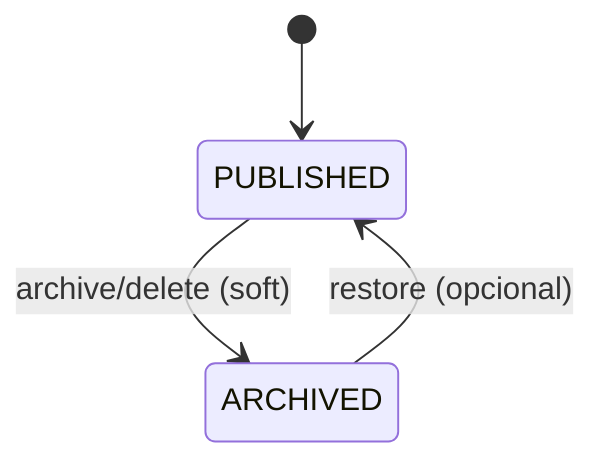
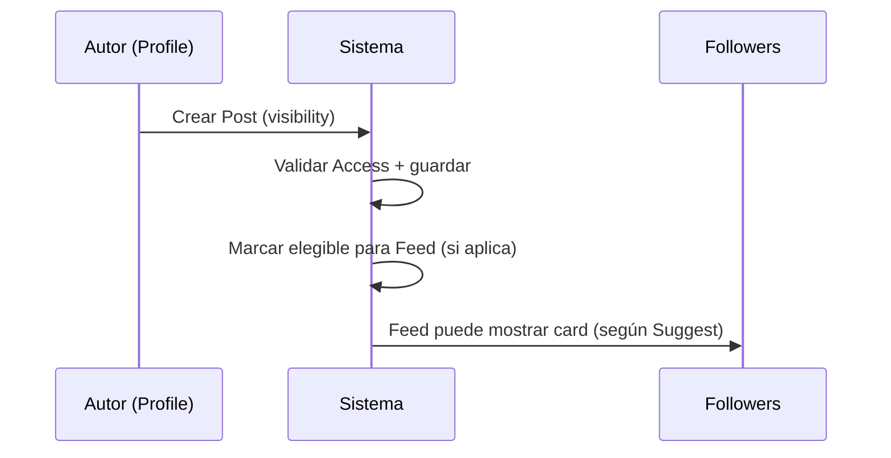

# Posts

## Context/Goal
Definir el sistema de **Posts** como publicación social dentro de VyteMerge.
Un Post es **social** (contenido) y puede, opcionalmente, **referenciar un Listing** (comercial) sin mezclar entidades.

## Scope
Incluye:
- Tipos de post (MVP)
- Visibilidad
- Superficies (Profile + Feed; Channel opcional)
- Lifecycle básico (publish/archive)

No incluye:
- Comentarios (fase 2)
- Reposts (fase 2)
- Editor avanzado (fase 2)

## Tipos de Post (MVP)
- `TEXT`: texto corto
- `MEDIA`: imagen/video + caption
- `LINK`: enlace con preview
- `LISTING_SHARE`: referencia a un Listing (ej: “turnos disponibles”)

## Visibilidad (Privacy)
- `PUBLIC`: visible para todos (si no hay block)
- `FOLLOWERS`: visible solo followers aprobados
- `UNLISTED`: no aparece en feed/listas; solo por link
- `PRIVATE`: solo owner (y delegados si aplica)

> Regla: la visibilidad declarada es intención; **Access** aplica enforcement final.

## Superficies (Targets)
- **Profile**: el Post siempre “vive” en el Profile del autor (si la visibilidad lo permite).
- **Feed/Suggest**: el Post entra como “card” si es elegible.
- **Channel** (opcional): publicar para una audiencia específica.

## Lifecycle (simple)
- `PUBLISHED`
- `ARCHIVED` (no aparece en profile/feed, pero se conserva histórico)

## Flujos
### Publicar Post y aparecer en Feed

### Post que referencia Listing
- Post: “Turnos disponibles esta semana 👇”
- Adjunta `ListingId`
- UI muestra card del Listing con CTA “Reservar”

## Reglas de consistencia
- Un Post puede referenciar **0..1 Listing** (MVP).
- Un Listing no depende de un Post para existir.
- UNLISTED: no se recomienda ni aparece en profile list, pero sí accesible por link.

## AC (Acceptance Criteria)
- Given post FOLLOWERS, when viewer no sigue, then no es visible.
- Given post UNLISTED, then no aparece en feed ni en listas; sí por link (si Access).
- Given post LISTING_SHARE, then muestra card del Listing (si viewer tiene permiso para ver el Listing).
