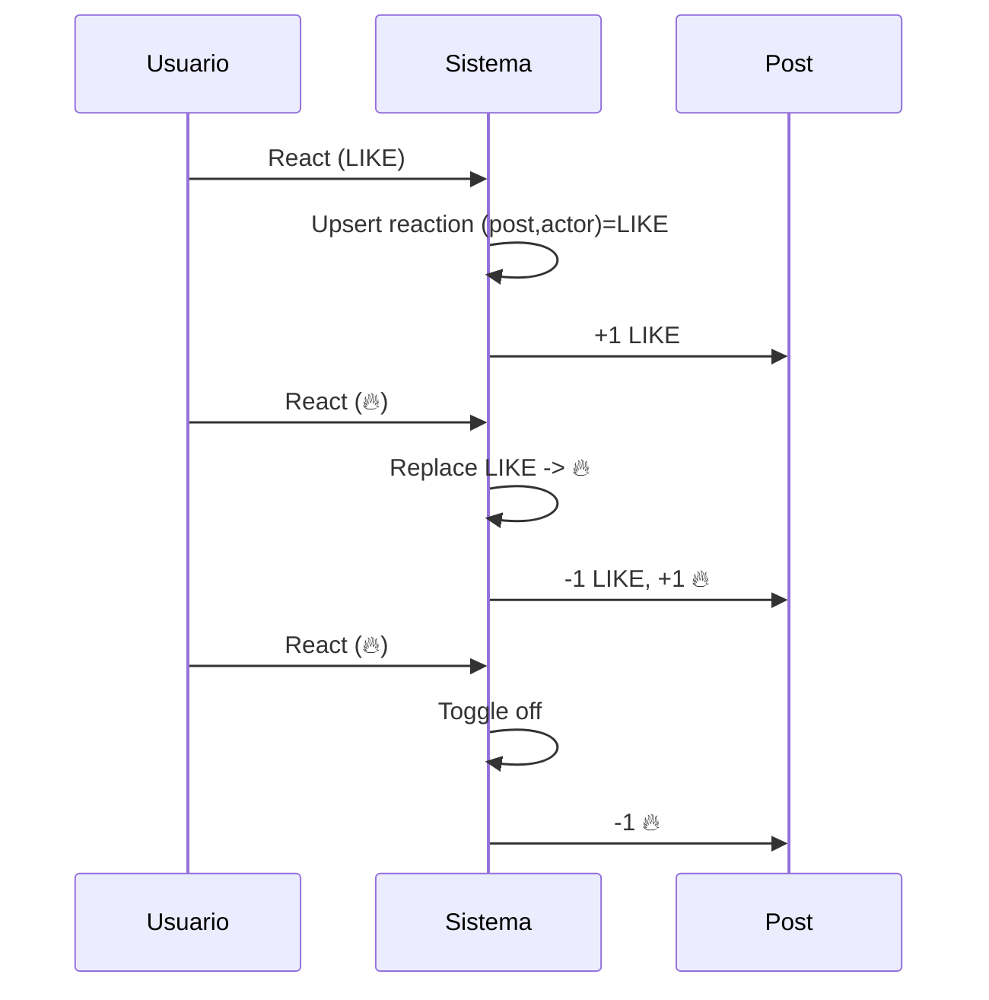

# Reactions

## Context/Goal
Definir cómo los usuarios expresan feedback rápido sobre Posts mediante **Like** y **Reactions** (set limitado).

## Scope
Incluye:
- Reacción única por usuario por post
- Toggle / replace
- Conteos agregados visibles en UI
- Reglas anti-spam mínimas

No incluye:
- Reactions sobre Listings (futuro)
- Comentarios (fase 2)

## Tipos de Reactions
- `LIKE` (default)
- Set cerrado de emojis (MVP sugerido): ❤️ 🎉 🔥 😂 😮 👏

> Mantener set cerrado simplifica UI, analytics y moderación.

## Reglas
1) Un actor puede tener **máximo 1 reaction activa** por Post.
2) Si reacciona con el mismo tipo → **toggle off**.
3) Si reacciona con distinto tipo → **replace** (cambia la reaction).
4) Reactions solo se permiten si el viewer puede **ver** el Post (Access).

## Flujos

## UI
- Mostrar:
  - total reactions
  - breakdown por tipo (tap para ver)
  - estado “reaccioné” del viewer (highlight)
- Acción:
  - tap rápido para LIKE
  - long-press (o menú) para elegir emoji

## Anti-abuse (mínimo)
- Rate limit por actor (ej: 60/min) y por post (burst control)
- Deshabilitar reactions si actor está blocked por autor

## AC (Acceptance Criteria)
- Given A reacciona LIKE, then existe 1 reaction activa y contador total incrementa.
- Given A reacciona 🔥 luego de LIKE, then cambia a 🔥 y se ajustan contadores.
- Given A reacciona 🔥 otra vez, then se elimina la reaction (toggle).
