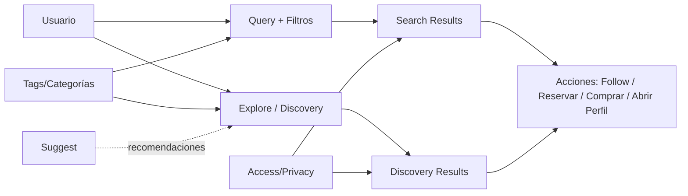

# Search & Discovery (Overview)

## Context/Goal
Este módulo define cómo los usuarios **encuentran** cosas en VyteMerge:
- **Search**: el usuario expresa intención con una query (texto, filtros).
- **Discovery**: el sistema sugiere/explora sin query explícita (browse, categorías, “cerca mío”, trending).

> Este documento **no** define implementación técnica (index, engine, proveedores). Define el sistema end-to-end, reglas y superficies.

## Scope
Incluye:
- Qué entidades son **buscables/descubribles**
- Qué superficies existen (search bar, explore, categorías, near me)
- Reglas de **eligibilidad** (qué puede aparecer) y **privacidad**
- Señales de ranking a nivel conceptual (sin algoritmos)

No incluye:
- Feed ranking profundo (vive en **Suggest**)
- Ads/Bidding (vive en Campaigns; aquí solo se define “sponsored placement” como superficie posible)
- Moderación avanzada

## Entidades principales (qué se encuentra)
- **Listings** (principal objeto comercial y promocionable)
- **Profiles** (personas/organizaciones)
- **Places** (ubicaciones)
- **Services/Products** (catálogo, como facet/landing)
- **Posts** (social; opcional en MVP)

## Modelo mental

## Integraciones con otros módulos
- **Access / Privacy**: decide la visibilidad final (profile privado, partner-only, unlisted).
- **Suggest**: ranking del feed/suggestions; aquí definimos elegibilidad y superficies.
- **Listings**: objeto comercial principal que se descubre.
- **Tags**: facetas y navegación por categorías.
- **Places**: base de “near me” (zona + timezone).
- **Social**: follows y posts como señales (si aplica).

## Principios
- **Primero Listings**: el loop comercial necesita discovery de oferta.
- **Privacidad primero**: nunca se recomienda lo que el viewer no puede ver.
- **Intención clara**: search responde a query; discovery responde a contexto.
- **Explicabilidad**: cuando se sugiere algo, debe poder explicarse (“cerca”, “popular”, “sigues a…”).

## KPIs
- Search success rate (clic/acción tras búsqueda)
- CTR de resultados (por tipo: listing/profile/place)
- Conversión: Search → Listing → Booking / Purchase
- Zero-result rate
