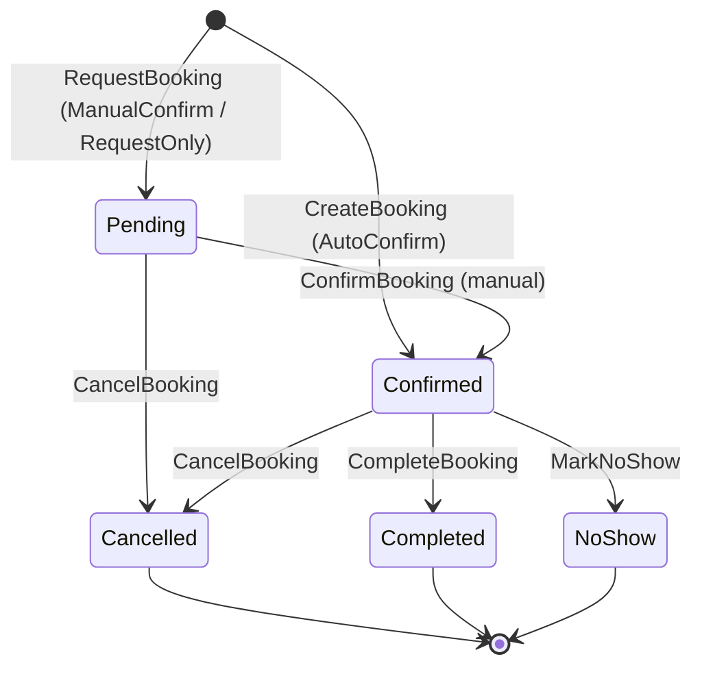
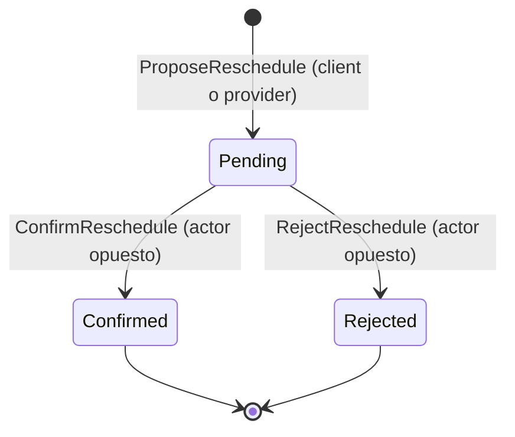

# Booking Lifecycle

## Estados

| Estado | Descripción |
|---|---|
| **Pending** | El usuario solicitó la reserva. El slot está en soft-hold. Ocurre cuando `Listing.confirmationPolicy = ManualConfirm \| RequestOnly`: el proveedor debe confirmar manualmente. Si `confirmationPolicy = AutoConfirm`, el booking pasa directamente a **Confirmed**. |
| **Confirmed** | La reserva está confirmada. El slot está bloqueado. Se crea un Event independiente linked a los timelines del proveedor y del cliente (ADR-0006). |
| **Cancelled** | La reserva fue cancelada por el usuario, el proveedor, o el sistema. El slot queda disponible nuevamente (re-proyección). |
| **Completed** | El servicio ocurrió y cerró. Estado terminal positivo. |
| **NoShow** | El attendee no se presentó. Estado terminal negativo. Puede disparar penalidades o incentivos según política. |

---

## Diagrama de transiciones

---

## Reglas por transición

### `[*] → Pending` (via `RequestBooking`)

- Se evalúa la disponibilidad del slot en el momento de la solicitud.
- Ocurre cuando `Listing.confirmationPolicy = ManualConfirm | RequestOnly`.
- El slot entra en soft-hold durante el estado Pending para evitar doble-booking.
- Evento emitido: `BookingRequested`.
- Ver: `RequestBooking vs CreateBooking` — `04-commands-events/events-catalog.md`.

### `[*] → Confirmed` (via `CreateBooking`)

- Ocurre cuando `Listing.confirmationPolicy = AutoConfirm`: confirmación inmediata.
- Módulo Events crea un **Event** (type=booking) linked a los timelines del proveedor y del cliente via `EventTimelineLink`.
- Evento emitido: `BookingCreated`.

### `Pending → Confirmed` (via `ConfirmBooking`)

- El proveedor aprueba manualmente la solicitud.
- Módulo Events crea un **Event** linked a los timelines del proveedor y del cliente (bloquea disponibilidad).
- Se disparan notificaciones al usuario y al proveedor.
- Evento emitido: `BookingConfirmed`.

### `Pending → Cancelled` (via `CancelBooking`)

- El usuario cancela antes de que el proveedor confirme, o el proveedor rechaza.
- El soft-hold se libera; el slot vuelve a estar disponible.
- Se reproyecta disponibilidad (módulo Events recalcula slots).
- Evento emitido: `BookingCancelled`.

### `Confirmed → Completed` (via `CompleteBooking`)

- El servicio ocurrió. El proveedor o el sistema marca la reserva como completada.
- El Event permanece como registro histórico (visible en los timelines linked).
- Si aplica: se ejecutan incentivos anti-cancelación (`Devolución por Compromiso`).
- Evento emitido: `BookingCompleted`.

### `Confirmed → Cancelled` (via `CancelBooking`)

- La reserva se cancela después de haber sido confirmada.
- Se aplican **políticas de cancelación** (plazo, penalidades, reembolsos) — ver `07-policies/` *(P0 pendiente)*.
- El Event se marca como cancelled; la disponibilidad se reproyecta. Los timelines linked reflejan el cambio automáticamente.
- Evento emitido: `BookingCancelled`.

### `Confirmed → NoShow` (via `MarkNoShow`)

- El proveedor (o el sistema) marca que el asistente no se presentó.
- Se pueden aplicar penalidades o impactos en reputación según política del Listing.
- Evento emitido: `BookingNoShow`.

---

## Reschedule — Sub-lifecycle de RescheduleRecord

Un Booking **Confirmed** puede tener asociado como máximo un `RescheduleRecord` activo.
El Booking en sí no cambia de estado durante un reschedule hasta que el slot se confirma.

### Estados de RescheduleRecord

| Estado | Descripción |
|---|---|
| **Pending** | El actor solicitante propuso un nuevo slot. Espera confirmación del otro actor. |
| **Confirmed** | El otro actor aceptó el nuevo slot. El Booking se actualiza al nuevo slot. |
| **Rejected** | El otro actor rechazó la propuesta. El Booking permanece en el slot original. |

**Reglas:**
- Solo puede haber **un** `RescheduleRecord` en estado `Pending` por Booking a la vez.
- `ConfirmReschedule` solo puede ejecutarlo el actor **opuesto** al que propuso.
- Al confirmar: el slot del Booking se actualiza, el Event se actualiza y la disponibilidad se reproyecta.
- Al rechazar: el Booking permanece en el slot original; se puede proponer un nuevo reschedule.
- Ver: Flow 11 — Cancelar, Reagendar y Policies.

---

## Invariantes

- Un Booking **Confirmed** debe tener un Event asociado, linked a los timelines del proveedor y del cliente (ADR-0006).
- Un Booking **Cancelled** o **Completed** o **NoShow** no puede transicionar a ningún otro estado.
- La disponibilidad del slot siempre refleja el estado actual de los Bookings activos (`Pending` + `Confirmed`).
- A lo sumo un `RescheduleRecord` en estado **Pending** por Booking (invariante de Flow 11).
- `ConfirmReschedule` solo puede ejecutarlo el actor opuesto al que inició la propuesta.

---

## Links

- Booking rules del Listing: `00-core-domain/04-bounded-contexts/03.Offer - Catalog & Listings/02.listing/05.booking_rules.md`
- RequestBooking vs CreateBooking: `01-domain-behavior/04-commands-events/events-catalog.md`
- Políticas de cancelación/reschedule/no-show: `04-bounded-contexts/07-policies/` — ver Flow 11
- Incentivos anti-cancelación: `02-product-variants/use-cases/incentivos-anticancelacion-noshow.md`
