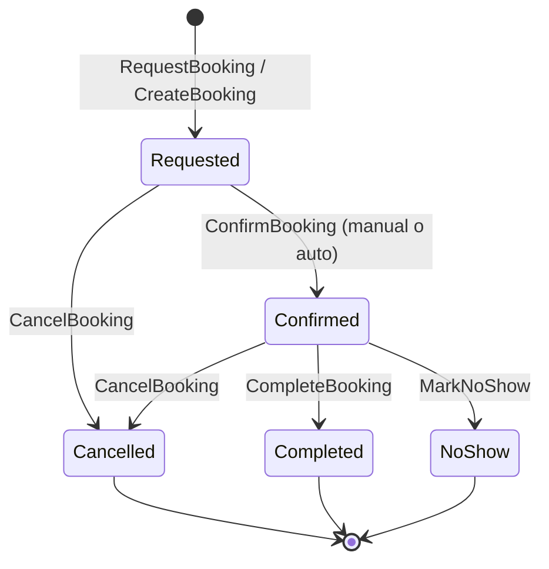

# Booking Lifecycle

## Estados

| Estado | Descripción |
|---|---|
| **Requested** | El usuario solicitó la reserva. El slot está tentativo (soft-hold). Puede requerir confirmación manual del proveedor (`confirmation_required = true`) o auto-confirmarse. |
| **Confirmed** | La reserva está confirmada. El slot está bloqueado. Se crea (o confirma) el Event asociado en el Timeline. |
| **Cancelled** | La reserva fue cancelada por el usuario, el proveedor, o el sistema. El slot queda disponible nuevamente (re-proyección). |
| **Completed** | El servicio ocurrió y cerró. Estado terminal positivo. |
| **NoShow** | El attendee no se presentó. Estado terminal negativo. Puede disparar penalidades o incentivos según política. |

---

## Diagrama de transiciones

---

## Reglas por transición

### `[*] → Requested` (via `RequestBooking` o `CreateBooking`)

- Se evalúa la disponibilidad del slot en el momento de la solicitud.
- Si `Listing.booking_rules.confirmation_required = false`: el booking pasa directamente a **Confirmed** (evento `BookingCreated`).
- Si `Listing.booking_rules.confirmation_required = true`: el booking queda en **Requested** (evento `BookingRequested`); el proveedor debe confirmar manualmente.
- El slot entra en soft-hold durante el estado Requested para evitar doble-booking.
- Ver: `RequestBooking vs CreateBooking` — `04-commands-events/events-catalog.md`.

### `Requested → Confirmed` (via `ConfirmBooking`)

- El proveedor aprueba manualmente la solicitud, o el sistema la auto-confirma si no requiere confirmación.
- Se crea el **Event** en el Timeline del proveedor (bloquea disponibilidad).
- Se disparan notificaciones al usuario y al proveedor.
- Evento emitido: `BookingConfirmed`.

### `Requested → Cancelled` (via `CancelBooking`)

- El usuario cancela antes de que el proveedor confirme, o el proveedor rechaza.
- El soft-hold se libera; el slot vuelve a estar disponible.
- Se reprojetta disponibilidad en el Timeline.
- Evento emitido: `BookingCancelled`.

### `Confirmed → Completed` (via `CompleteBooking`)

- El servicio ocurrió. El proveedor o el sistema marca la reserva como completada.
- El Event en el Timeline permanece como registro histórico.
- Si aplica: se ejecutan incentivos anti-cancelación (`Devolución por Compromiso`).
- Evento emitido: `BookingCompleted`.

### `Confirmed → Cancelled` (via `CancelBooking`)

- La reserva se cancela después de haber sido confirmada.
- Se aplican **políticas de cancelación** (plazo, penalidades, reembolsos) — ver `07-policies/` *(P0 pendiente)*.
- El Event en el Timeline se cancela o elimina; la disponibilidad se reprojetta.
- Evento emitido: `BookingCancelled`.

### `Confirmed → NoShow` (via `MarkNoShow`)

- El proveedor (o el sistema) marca que el asistente no se presentó.
- Se pueden aplicar penalidades o impactos en reputación según política del Listing.
- Evento emitido: `BookingNoShow`.

---

## Invariantes

- Un Booking **Confirmed** debe tener un Event asociado en el Timeline correspondiente.
- Un Booking **Cancelled** o **Completed** o **NoShow** no puede transicionar a ningún otro estado.
- La disponibilidad del slot siempre refleja el estado actual de los Bookings activos (`Requested` + `Confirmed`).

---

## Links

- Booking rules del Listing: `00-core-domain/04-bounded-contexts/03.Offer - Catalog & Listings/02.listing/05.booking_rules.md`
- RequestBooking vs CreateBooking: `01-domain-behavior/04-commands-events/events-catalog.md`
- Políticas de cancelación/reschedule/no-show: `04-bounded-contexts/07-policies/` *(P0 — pendiente)*
- Incentivos anti-cancelación: `02-product-variants/use-cases/incentivos-anticancelacion-noshow.md`
