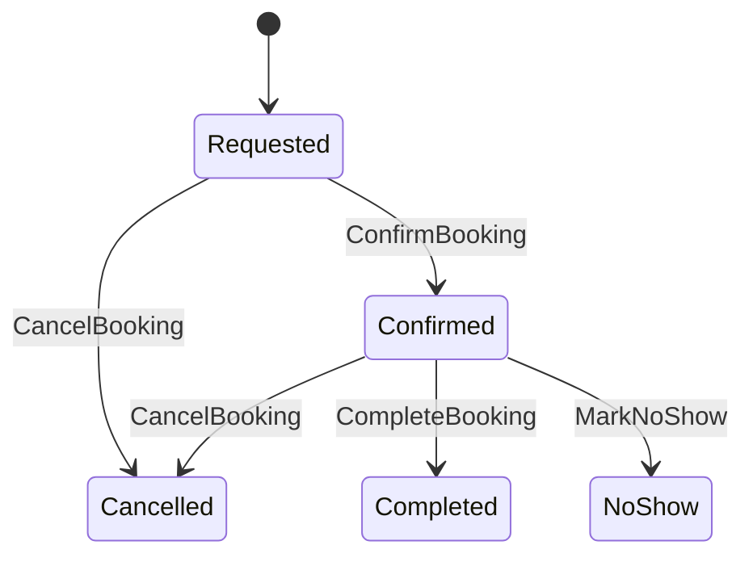

# Booking Lifecycle (draft)

> Este lifecycle está **curado** para soportar flujos end-to-end.  
> Algunos estados exactos pueden variar según el modelo final.  

## Estados sugeridos
- **Requested**: usuario solicitó; aún puede requerir confirmación (si aplica).
- **Confirmed**: reservado y bloquea el slot/event.
- **Cancelled**: cancelado por usuario o negocio.
- **Completed**: ocurrió y cerró.
- **NoShow**: no se presentó (si aplica).

## Reglas (high level)
- Confirmed debe reflejarse como **Event** en Timeline (y bloquear disponibilidad).
- Cancelled debe liberar disponibilidad (reprojection) según rules.
- NoShow puede disparar incentivos/penalidades (ver use cases de anti-cancel/no-show).

## Links
- Booking rules (Listing): `docs/00-core-domain/04-bounded-contexts/03.Offer - Catalog & Listings/02.listing/05.booking_rules.md`
- Use case incentivos anti-cancel/no-show: `docs/02-product-variants/use-cases/incentivos-anticancelacion-noshow.md`
