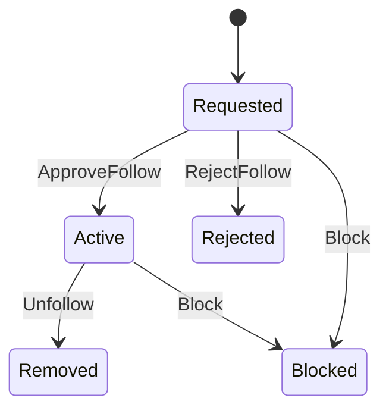

# Follow Lifecycle (draft)

## Estados
- **Requested** (si requiere aprobación)
- **Active**
- **Rejected**
- **Blocked** (moderación/abuse)
- **Removed** (unfollow)

## Links
- Social graph: `docs/00-core-domain/04-bounded-contexts/04.Social & Discovery/01.social/03.social-graph.md`
- Privacy/moderation: `docs/00-core-domain/04-bounded-contexts/04.Social & Discovery/01.social/06.privacy-moderation.md`
