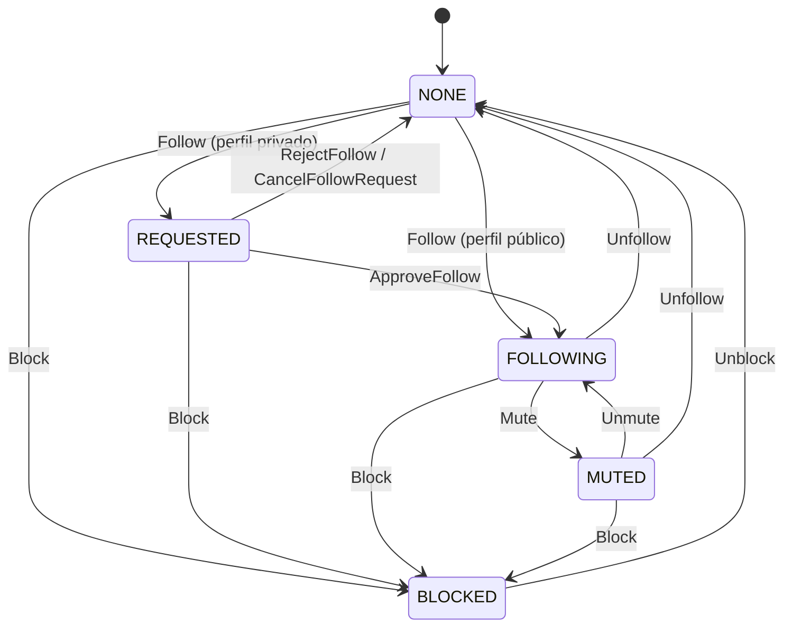

# Follow Lifecycle

## Estados canónicos

| Estado | Descripción |
|---|---|
| **NONE** | No hay relación entre los dos actores. |
| **REQUESTED** | Follow pendiente de aprobación (perfil privado). |
| **FOLLOWING** | Follow activo: el follower ve el contenido del followee según su visibilidad. |
| **MUTED** | Follow activo pero el followee no aparece en el feed del follower. No afecta permisos ni visibilidad. |
| **BLOCKED** | Bloqueo activo. El bloqueado no puede ver Profile, Posts ni Listings del bloqueante, ni interactuar. Se eliminan follows en ambos sentidos. |

> **Nota:** `REJECTED` y `REMOVED` son acciones/transiciones, no estados persistidos — la relación vuelve a `NONE`.

## Reglas

- **Perfil público:** follow inmediato → estado `FOLLOWING`.
- **Perfil privado:** follow crea `REQUESTED`; requiere `ApproveFollow` del dueño del perfil.
- **Mute:** solo afecta el feed del follower. El followee sigue siendo visible en otros contextos (Profile, Explore). No notifica al followee.
- **Block:** elimina cualquier follow existente en ambas direcciones; el bloqueado pasa a no ver nada del bloqueante.
- **Mutual follow:** dos edges independientes, uno por dirección.

## Links

- Social graph completo (estados + diagrama extendido): `00-core-domain/04-bounded-contexts/04-social-discovery/01.social/03.social-graph.md`
- Privacy/moderation: `00-core-domain/04-bounded-contexts/04-social-discovery/01.social/06.privacy-moderation.md`
- Flow 03 — Follow, Feed y Posts: `01-domain-behavior/01-core-flows/03-follow-and-feed.md`
- Flow 14 — Moderación (Block/Mute): pendiente
