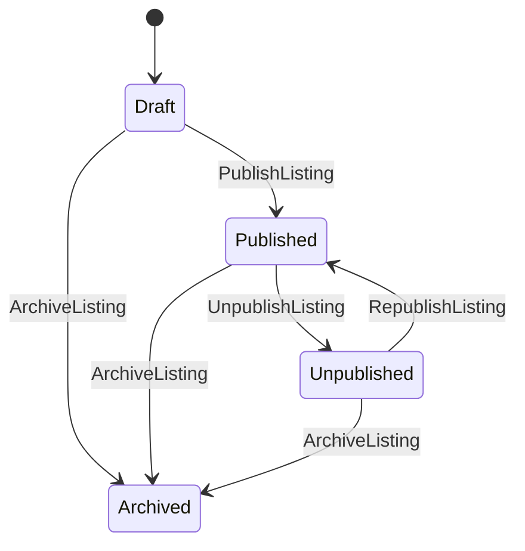

# Listing Lifecycle (curated)

Este documento resume el lifecycle del Listing y cómo afecta el comportamiento end-to-end.  
La fuente de verdad de reglas detalladas vive en el Bounded Context de Offer.

## Estados
- **Draft**: editable, no distribuido, no indexable.
- **Published**: distribuible, indexable (según rules), puede generar bookings.
- **Unpublished**: pausa reversible, no distribuido, no nuevos bookings.
- **Archived**: histórico, no distribuido.

## Transiciones principales

## Impacto por estado
| Estado | Aparece en Discovery/Search | Permite nuevos Bookings | Permite edición | Notas |
|---|---|---:|---:|---|
| Draft | No | No | Sí | Preview owner-only |
| Published | Sí (si eligible) | Sí | Parcial | Cambios pueden requerir reindex/reprojection |
| Unpublished | No | No | Sí | Mantiene histórico |
| Archived | No | No | No/limitado | Solo histórico |

## Projections afectadas
- `SlotsProjected` (cuando cambia scheduling/rules/timeline)
- `DiscoveryIndexUpdated` (publish/unpublish/archive)
- `FeedEligibilityUpdated`
- `MetricsUpdated`

## Links
- Listing Status & Lifecycle: `docs/00-core-domain/04-bounded-contexts/03.Offer - Catalog & Listings/02.listing/13.status_lifecycle.md`
