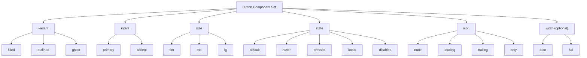
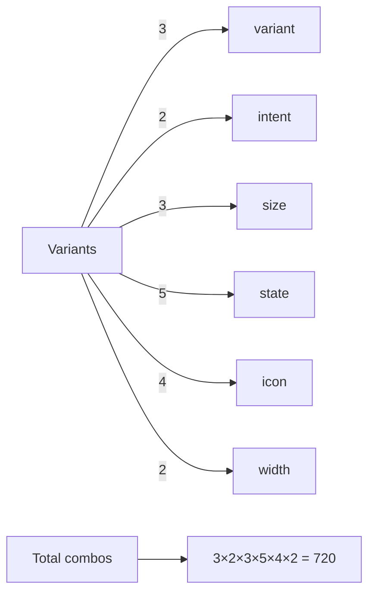

# Button

> **Convención:** los nombres de tokens, propiedades y variantes se mantienen en **inglés** (contrato con código).  
> Esta documentación está en **español** y se basa en tus **Semantic Colors** reales (`surface/content/border/ring/action/feedback`) + tus **Semantic Sizes** + **Semantic Typography**.

---

## Qué problema resuelve

`Button` es el componente base para acciones (CTA). Esta guía define:

- **API del componente** (variants/props) para Figma y código.
- **Reglas de comportamiento** (states).
- **Mapping exacto** de colores usando tus tokens existentes: `action.*` + `ring.focus`.
- Qué partes dependen de `Semantic Sizes` (radius/stroke/space) y `Semantic Typography` (text size/weight).

---

## Terminología de tokens

En tu sistema de tokens de color existen estos namespaces:

- `surface.*` → fondos/superficies generales
- `content.*` → colores de texto/íconos para contenido general
- `border.*` → bordes globales (neutrales)
- `ring.*` → colores de focus ring
- `action.*` → colores para **acciones** (botones/links) en variantes `filled/outlined`
- `feedback.*` → colores para estados de feedback (success/warning/error/info)

### ¿Qué es `action`?

`action` **no es un token único**, es un **grupo** que contiene colores para controles interactivos.
Ejemplos (existentes):

- `action.primary.filled.bg.default`
- `action.primary.outlined.text.hover`
- `action.accent.outlined.border.disabled`

---

## API del componente

Propiedades recomendadas (Figma Component Set / props en código):

- `intent`: `primary | accent`
- `variant`: `filled | outlined | ghost`
- `size`: `sm | md | lg`
- `state`: `default | hover | pressed | focus | disabled`
- `icon`: `none | leading | trailing | only`
- `width`: `auto | full` *(opcional)*

> Nota: hoy **no** definimos `intent=danger` porque no existen tokens `action.danger.*`.  
> Más adelante se puede agregar sin romper el API.

---

## Anatomía

Estructura (conceptual):

- Container (auto layout)
  - Optional icon (leading/trailing/only)
  - Label

Reglas:

- `icon=none`: no renderiza íconos
- `icon=only`: no renderiza label, y el botón debe mantener forma cuadrada (ancho≈alto)
- `loading` (si se agrega): recomienda reemplazar ícono por spinner manteniendo ancho estable

---

## Tamaños

Si todavía no existen tokens `component.button.*`, este componente consume directamente `space.*` y `text.size.*`.

Propuesta (ajustable):

| size | padding-y | padding-x | label typography | label weight |
|---|---:|---:|---|---|
| sm | `space.2xs` | `space.sm` | `text.size.sm` | `font.weight.medium` |
| md | `space.xs`  | `space.md` | `text.size.base` | `font.weight.medium` |
| lg | `space.sm`  | `space.lg` | `text.size.lg` | `font.weight.medium` |

Icon size (propuesta):
- sm: 16
- md: 16
- lg: 18

Radius:
- Usar `radius.md` (o `radius.lg` si querés estética más redondeada)

---

## Border + Focus ring

### Border (solo `outlined`)
- Border width: `stroke.thin`

### Focus ring (todos los variants)
Cuando `state=focus`:
- Ring color: `ring.focus`
- Ring thickness: `stroke.focusRing`

> En Figma puede representarse como stroke externo (outside) o un “halo” (shape) detrás.  
> En código, típicamente es un `outline` / `box-shadow` con ese color y grosor.

---

## Variants

### `filled`
- Background: `action.<intent>.filled.bg.<state>`
- Text/Icon: `action.<intent>.filled.text`
- Border: none

### `outlined`
- Background: `action.<intent>.outlined.bg.<state>`
- Border: `action.<intent>.outlined.border.<state>`
- Text/Icon: `action.<intent>.outlined.text.<state>`
- Border width: `stroke.thin`

### `ghost`
Ghost no tiene tokens propios: se construye **sin border** y con background transparente en `default`.

- Background:
  - `default`: none (transparent)
  - `hover|focus|pressed`: `action.<intent>.outlined.bg.<state>`
- Text/Icon:
  - `default|hover|focus|disabled`: `action.<intent>.outlined.text.<state>`
- Border: none
- Focus: ring igual a todos

---

## States

Estados soportados:

- `default`: estado base
- `hover`: feedback de hover
- `pressed`: feedback al presionar
- `focus`: accesibilidad (ring visible)
- `disabled`: deshabilitado

### Regla de oro
Los states **solo cambian tokens** (bg/border/text) y/o ring. No se usan hex manuales.

---

## Mapping exacto de tokens (por intent/variant/state)

> Los nombres que aparecen debajo existen en tu export actual de **Semantic Colors**.

### intent = `primary`

#### Variant: `filled`
- Text/Icon: `action.primary.filled.text`
- BG:
  - `action.primary.filled.bg.default`
  - `action.primary.filled.bg.hover`
  - `action.primary.filled.bg.pressed`
  - `action.primary.filled.bg.disabled`
  - `action.primary.filled.bg.disabledLight` *(opcional)*

Mapping por state:

| state | background | text/icon | ring |
|---|---|---|---|
| default | `action.primary.filled.bg.default` | `action.primary.filled.text` | — |
| hover | `action.primary.filled.bg.hover` | `action.primary.filled.text` | — |
| pressed | `action.primary.filled.bg.pressed` | `action.primary.filled.text` | — |
| focus | `action.primary.filled.bg.default` | `action.primary.filled.text` | `ring.focus` |
| disabled | `action.primary.filled.bg.disabled` | `content.text.primary.disabled` | — |

> Nota: no existe `action.primary.filled.text.disabled`.  
> Por eso, para texto disabled usamos `content.text.primary.disabled`.

#### Variant: `outlined`
Tokens:
- BG: `action.primary.outlined.bg.*`
- Border: `action.primary.outlined.border.*`
- Text: `action.primary.outlined.text.*`

Mapping:

| state | background | border | text/icon | ring |
|---|---|---|---|---|
| default | `action.primary.outlined.bg.default` | `action.primary.outlined.border.default` | `action.primary.outlined.text.default` | — |
| hover | `action.primary.outlined.bg.hover` | `action.primary.outlined.border.hover` | `action.primary.outlined.text.hover` | — |
| pressed | `action.primary.outlined.bg.pressed` | `action.primary.outlined.border.focus` | `action.primary.outlined.text.focus` | — |
| focus | `action.primary.outlined.bg.focus` | `action.primary.outlined.border.focus` | `action.primary.outlined.text.focus` | `ring.focus` |
| disabled | `action.primary.outlined.bg.disabled` | `action.primary.outlined.border.disabled` | `action.primary.outlined.text.disabled` | — |

#### Variant: `ghost`
Ghost = outlined sin border y sin bg en default.

| state | background | text/icon | ring |
|---|---|---|---|
| default | none | `action.primary.outlined.text.default` | — |
| hover | `action.primary.outlined.bg.hover` | `action.primary.outlined.text.hover` | — |
| pressed | `action.primary.outlined.bg.pressed` | `action.primary.outlined.text.focus` | — |
| focus | `action.primary.outlined.bg.focus` | `action.primary.outlined.text.focus` | `ring.focus` |
| disabled | none | `action.primary.outlined.text.disabled` | — |

---

### intent = `accent`

#### Variant: `filled`
- Text/Icon: `action.accent.filled.text`
- BG:
  - `action.accent.filled.bg.default`
  - `action.accent.filled.bg.hover`
  - `action.accent.filled.bg.pressed`
  - `action.accent.filled.bg.disabled`
  - `action.accent.filled.bg.disabledLight` *(opcional)*

Mapping:

| state | background | text/icon | ring |
|---|---|---|---|
| default | `action.accent.filled.bg.default` | `action.accent.filled.text` | — |
| hover | `action.accent.filled.bg.hover` | `action.accent.filled.text` | — |
| pressed | `action.accent.filled.bg.pressed` | `action.accent.filled.text` | — |
| focus | `action.accent.filled.bg.default` | `action.accent.filled.text` | `ring.focus` |
| disabled | `action.accent.filled.bg.disabled` | `content.text.primary.disabled` | — |

#### Variant: `outlined`

| state | background | border | text/icon | ring |
|---|---|---|---|---|
| default | `action.accent.outlined.bg.default` | `action.accent.outlined.border.default` | `action.accent.outlined.text.default` | — |
| hover | `action.accent.outlined.bg.hover` | `action.accent.outlined.border.hover` | `action.accent.outlined.text.hover` | — |
| pressed | `action.accent.outlined.bg.pressed` | `action.accent.outlined.border.focus` | `action.accent.outlined.text.focus` | — |
| focus | `action.accent.outlined.bg.focus` | `action.accent.outlined.border.focus` | `action.accent.outlined.text.focus` | `ring.focus` |
| disabled | `action.accent.outlined.bg.disabled` | `action.accent.outlined.border.disabled` | `action.accent.outlined.text.disabled` | — |

#### Variant: `ghost`

| state | background | text/icon | ring |
|---|---|---|---|
| default | none | `action.accent.outlined.text.default` | — |
| hover | `action.accent.outlined.bg.hover` | `action.accent.outlined.text.hover` | — |
| pressed | `action.accent.outlined.bg.pressed` | `action.accent.outlined.text.focus` | — |
| focus | `action.accent.outlined.bg.focus` | `action.accent.outlined.text.focus` | `ring.focus` |
| disabled | none | `action.accent.outlined.text.disabled` | — |

---

## Accesibilidad

- `state=focus` siempre debe mostrar ring visible (`ring.focus` + `stroke.focusRing`).
- `disabled` debe comunicar deshabilitado (no solo por color; idealmente también por cursor/interaction en código).

---

## Roadmap de tokens (opcional)

Para facilitar consistencia y evitar “layout decisions” dentro del componente:

1) Tokens de sizing del componente:
- `component.button.paddingX.sm|md|lg`
- `component.button.paddingY.sm|md|lg`
- `component.button.gap`
- `component.button.iconSize.sm|md|lg`

2) Tokens de texto disabled para filled:
- `action.<intent>.filled.text.disabled` *(para evitar el fallback a `content.text.primary.disabled`)*

3) Token de border pressed (si lo querés explícito):
- `action.<intent>.outlined.border.pressed`

---

## Vista gráfica del API de variantes

---

## Qué combinaciones hay que cubrir (documentación mínima)

> No tiene sentido renderizar todas las combinaciones posibles (ver “explosión combinatoria”).  
> Para documentación, esta cobertura mínima suele ser suficiente:

| Grupo | Qué mostrar | Por qué |
|---|---|---|
| Sizes | `sm/md/lg` con `filled + primary + default` | compara dimensiones/tipografía |
| Variants | `filled/outlined/ghost` con `primary + md + default` | compara estilos base |
| Intents | `primary/accent` con `filled + md + default` | compara tonalidad |
| States | `default/hover/pressed/focus/disabled` con `primary + md + filled` | comportamiento |
| Icon | `none/leading/trailing/only` con `primary + md + filled + default` | anatomía |
| Width (opcional) | `auto/full` con `primary + md + filled + default` | uso en formularios |

### Matriz core (qué existe)

| intent \ variant | filled | outlined | ghost |
|---|---:|---:|---:|
| primary | ✅ | ✅ | ✅ |
| accent | ✅ | ✅ | ✅ |

---

## Matrices de estados por variant (tokens exactos)

> `intent` ∈ `{primary, accent}`

### filled

| state | background token | text token | ring |
|---|---|---|---|
| default | `action.<intent>.filled.bg.default` | `action.<intent>.filled.text` | — |
| hover | `action.<intent>.filled.bg.hover` | `action.<intent>.filled.text` | — |
| pressed | `action.<intent>.filled.bg.pressed` | `action.<intent>.filled.text` | — |
| focus | `action.<intent>.filled.bg.default` | `action.<intent>.filled.text` | `ring.focus` + `stroke.focusRing` |
| disabled | `action.<intent>.filled.bg.disabled` | `content.text.primary.disabled` | — |

### outlined

| state | bg token | border token | text token | ring |
|---|---|---|---|---|
| default | `action.<intent>.outlined.bg.default` | `action.<intent>.outlined.border.default` | `action.<intent>.outlined.text.default` | — |
| hover | `action.<intent>.outlined.bg.hover` | `action.<intent>.outlined.border.hover` | `action.<intent>.outlined.text.hover` | — |
| pressed | `action.<intent>.outlined.bg.pressed` | `action.<intent>.outlined.border.focus` | `action.<intent>.outlined.text.focus` | — |
| focus | `action.<intent>.outlined.bg.focus` | `action.<intent>.outlined.border.focus` | `action.<intent>.outlined.text.focus` | `ring.focus` + `stroke.focusRing` |
| disabled | `action.<intent>.outlined.bg.disabled` | `action.<intent>.outlined.border.disabled` | `action.<intent>.outlined.text.disabled` | — |

### ghost

| state | bg token | text token | ring |
|---|---|---|---|
| default | none | `action.<intent>.outlined.text.default` | — |
| hover | `action.<intent>.outlined.bg.hover` | `action.<intent>.outlined.text.hover` | — |
| pressed | `action.<intent>.outlined.bg.pressed` | `action.<intent>.outlined.text.focus` | — |
| focus | `action.<intent>.outlined.bg.focus` | `action.<intent>.outlined.text.focus` | `ring.focus` + `stroke.focusRing` |
| disabled | none | `action.<intent>.outlined.text.disabled` | — |

---

## Explosión combinatoria (por qué no documentamos todo junto)

