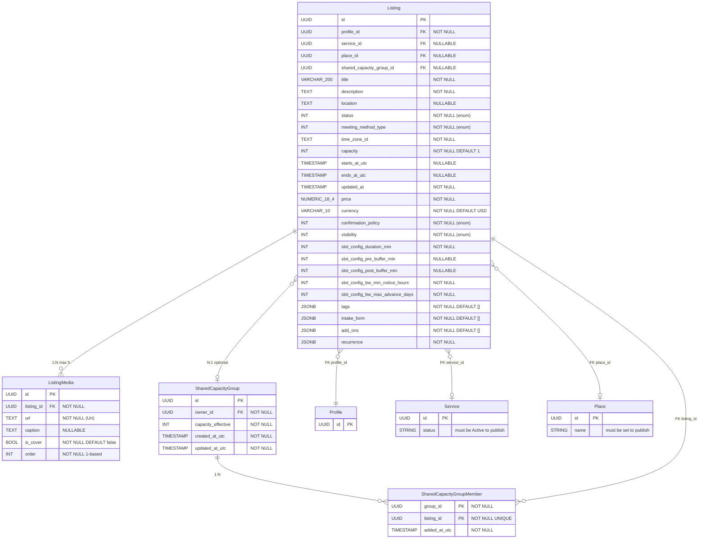
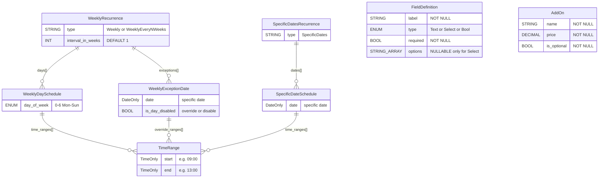
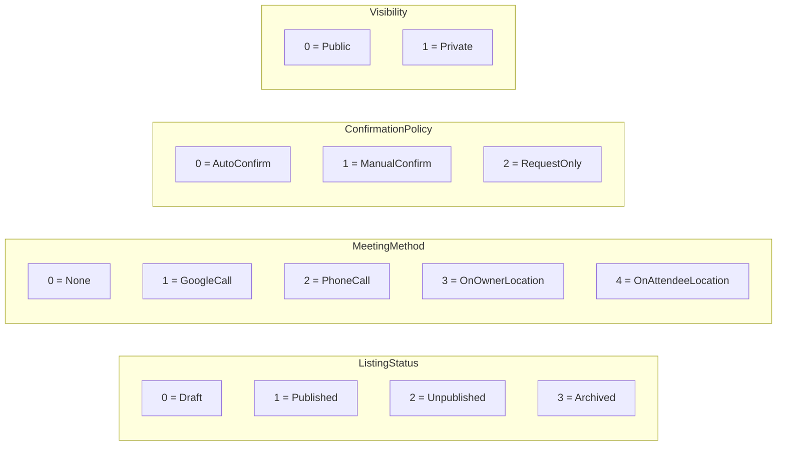
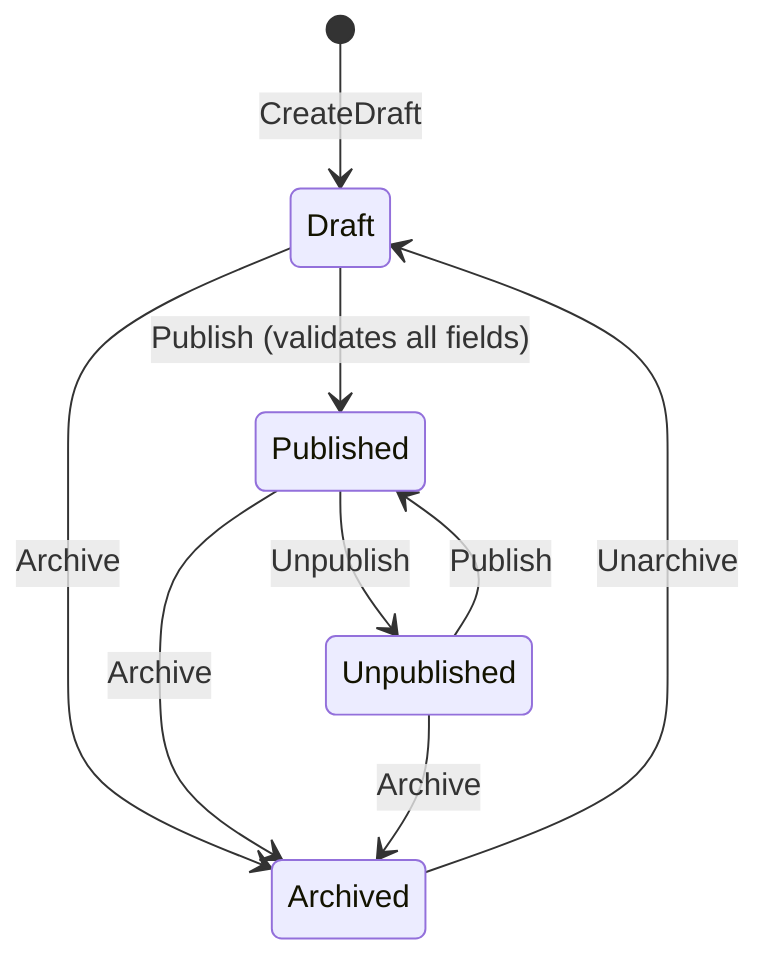

# Listing Domain Model — vt-core Backend

## Entity Relationship Diagram

## JSONB Structures

## Enums

## Status Lifecycle

## Publish Validation Rules

To transition from Draft/Unpublished → Published, ALL must be true:
- `title` non-empty
- `description` non-empty
- `place_id` is set
- `price` >= 0
- `slot_config.duration_min` > 0
- at least one `ListingOption` exists and validates for publish
- linked `Service` (if service_id set) must have status = Active

> Channels (audiencias comunidad-style) fueron diferidos post-v1 — ver [ADR-0007](../../../private/decisions/ADR-0007-channels-deferred-from-v1.md).

## Default Weekly Schedule (on creation)

Monday–Friday, two blocks per day:
- 09:00 – 13:00
- 16:00 – 20:00
