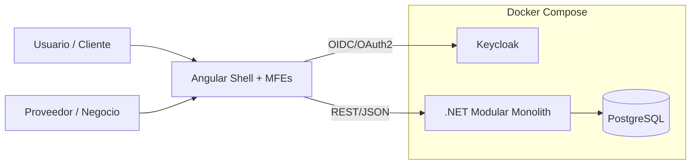
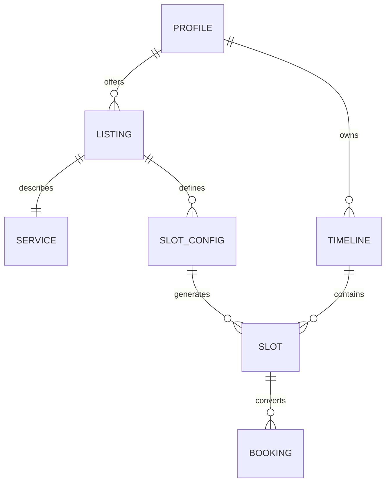
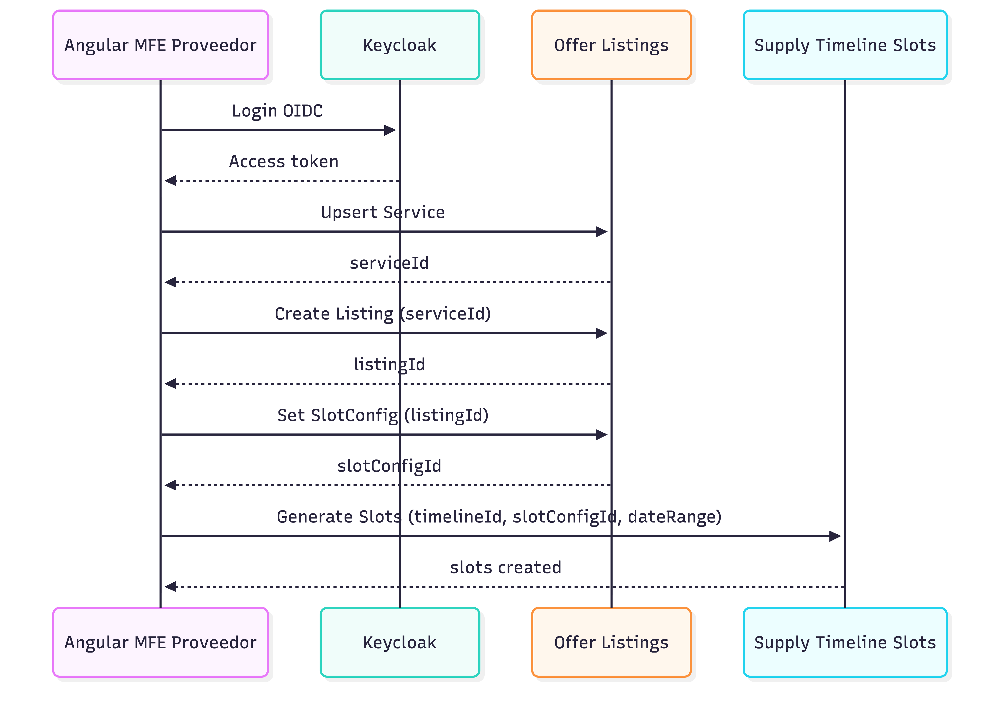
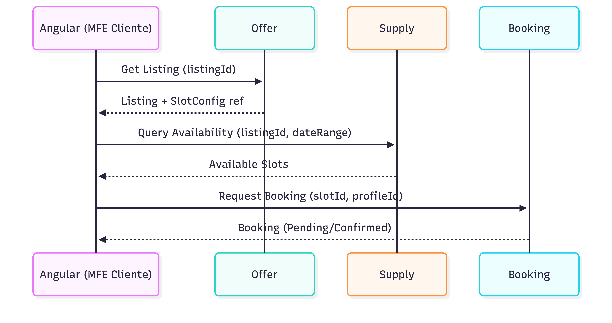
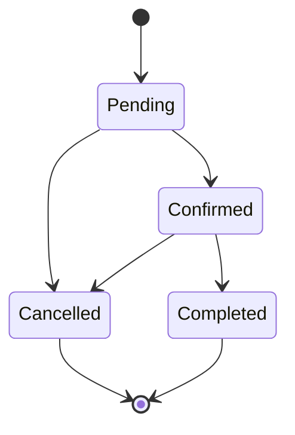
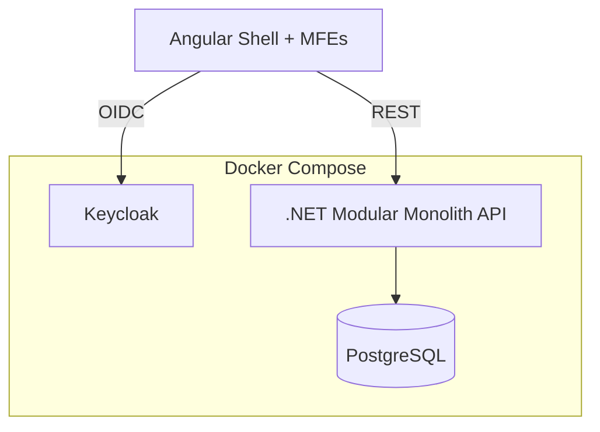

# VyteMerge — Arquitectura (simple y concisa)

## Objetivo
Mostrar **cómo fluye el sistema** para “vender” un **Listing** (publicación) a través de **configurar y generar Slots** (disponibilidad) y convertirlos en **Bookings** (reservas).

## Stack (actual)
- **Frontend**: Angular + **Micro Frontends (Module Federation)** (Shell + MFEs)
- **Identity**: **Keycloak** (service) para AuthN/AuthZ
- **Backend**: .NET Core **Modular Monolith**
- **DB**: **PostgreSQL**
- **Infra dev**: Docker / Docker Compose

---

## 1) Diagrama de sistema (alto nivel)

---

## 2) Módulos (solo los necesarios para el flujo Listing → Slots → Booking)

| Módulo (backend) | Responsabilidad | Entidades clave |
|---|---|---|
| Identity (Keycloak) | Login, tokens, roles/claims | Realm, Client, User, Role |
| Profiles | Identidad de negocio (proveedor/cliente) | Profile |
| Offer (Catalog & Listings) | Crear y publicar oferta | Service, Listing, Form (opcional) |
| Supply (Time & Place) | Disponibilidad y reglas de generación | Timeline, Slot, SlotConfig, Place (opcional) |
| Booking | Reservas sobre slots | Booking (y estados) |
| Communication (opcional) | Notificaciones (confirmaciones) | Notification |

> Nota: si hoy Booking vive dentro de Supply en tu monolito, podés dejarlo como submódulo; la separación aquí es **conceptual**.

---

## 3) Modelo mínimo (relaciones clave)

**Lectura**
- Un **Listing** representa “lo que vendés” (Service + reglas).
- Un **SlotConfig** define “cómo genero slots” (duración, días, buffers, reglas).
- El **Timeline** es la fuente de verdad del tiempo del proveedor.
- Los **Slots** se generan/registran en un Timeline y luego se convierten en **Bookings**.

---

## 4) Flujo principal (end-to-end) — Proveedor publica, cliente reserva

### 4.1 Proveedor: crear Service + Listing + SlotConfig y generar Slots

### 4.2 Cliente: ver disponibilidad y crear Booking

---

## 5) Estados mínimos (para no complicar)

---

## 6) Deployment (dev) — Docker Compose (conceptual)

---

## Checklist (para alinear código ↔ doc)
- [ ] Confirmar dónde vive **SlotConfig** (Offer vs Supply) y mantener 1 solo owner.
- [ ] Definir 1 endpoint/command “**GenerateSlots**” con inputs claros (dateRange + rules).
- [ ] Definir “**QueryAvailability**” como lectura optimizada (listingId + rango).
- [ ] Definir transición de estados de Booking (mínimo: Pending/Confirmed/Cancelled/Completed).
