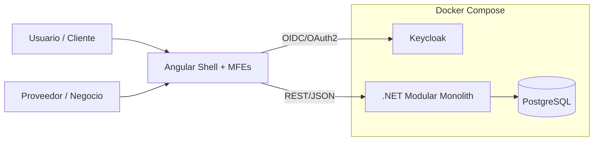
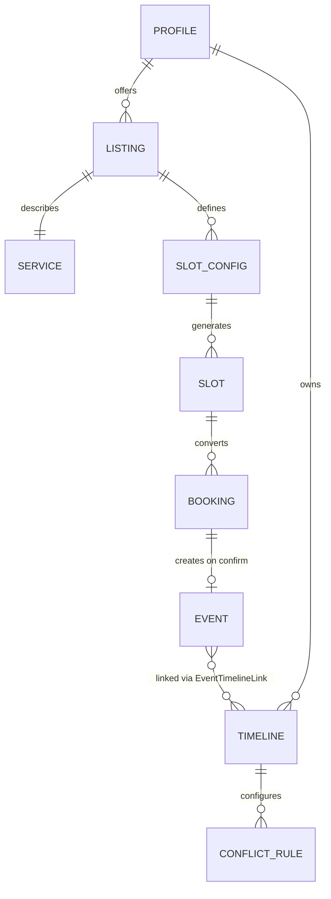
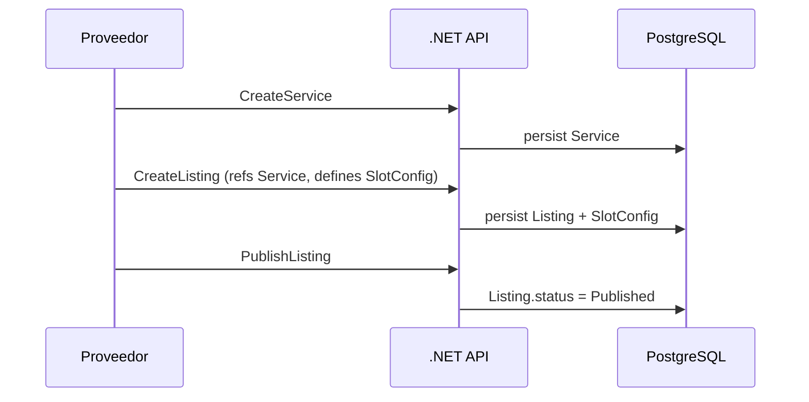
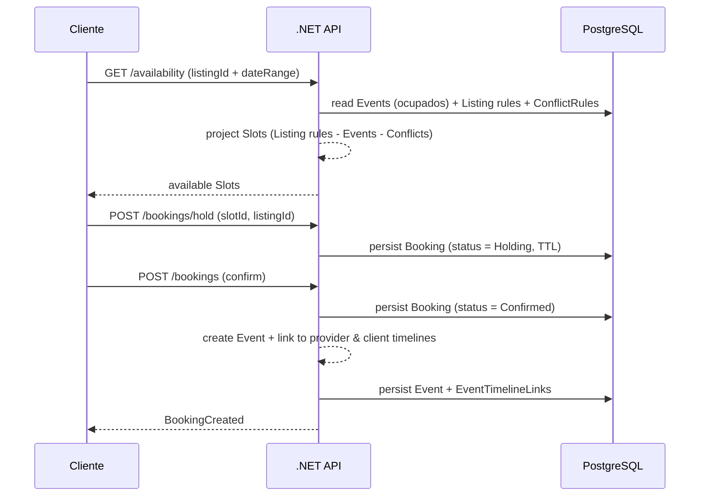
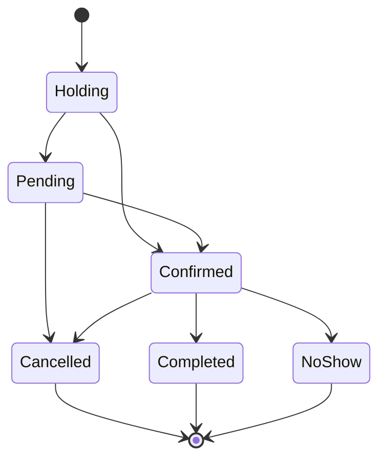
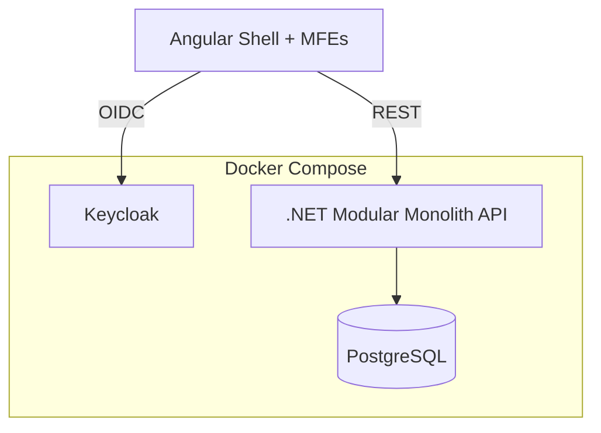

# VyteMerge — Arquitectura (simple y concisa)

## Objetivo
Mostrar **cómo fluye el sistema** para "vender" un **Listing** (publicación) a través de **configurar y generar Slots** (disponibilidad) y convertirlos en **Bookings** (reservas).

## Stack (actual)
- **Frontend**: Angular + **Micro Frontends (Module Federation)** (Shell + MFEs)
- **Identity**: **Keycloak** (service) para AuthN/AuthZ
- **Backend**: .NET Core **Modular Monolith**
- **DB**: **PostgreSQL**
- **Infra dev**: Docker / Docker Compose

---

## 1) Diagrama de sistema (alto nivel)

---

## 2) Módulos (flujo Listing → Slots → Booking)

| Módulo (backend) | Responsabilidad | Entidades clave |
|---|---|---|
| Identity (Keycloak) | Login, tokens, roles/claims | Realm, Client, User, Role |
| Profiles | Identidad de negocio (proveedor/cliente) | Profile |
| Catalog | Definir qué se ofrece | Service |
| Listing | Definir cómo se vende (scheduling, pricing, media) | Listing, SlotConfig, Recurrence |
| Timelines | Configuración de agendas y reglas de conflicto | Timeline, ConflictRule |
| Events | Lo que ocupa tiempo + slot projection | Event, EventTimelineLink, ConflictDetection |
| Booking | Transacción de reserva | Booking (hold → confirm → complete) |
| Communication (opcional) | Notificaciones (confirmaciones) | Notification |

> **ADR-0006:** Event es entidad independiente linked a N Timelines (no owned por Timeline). Slot Projection vive en Events.

---

## 3) Modelo mínimo (relaciones clave)

**Lectura**
- Un **Listing** representa "lo que vendés" (Service + reglas).
- Un **SlotConfig** define "cómo genero slots" (duración, días, buffers, reglas).
- El **Timeline** es la configuración de la agenda (privacy, conflict rules, members).
- Los **Events** son entidades independientes linked a N Timelines — representan "lo que ocupa tiempo".
- Los **Slots** se proyectan (query-time) desde Listing rules - Events ocupados - ConflictRules.
- Los **Bookings** son transacciones que al confirmarse crean un Event linked a los timelines relevantes.

---

## 4) Flujo principal (end-to-end) — Proveedor publica, cliente reserva

### 4.1 Proveedor: crear Service + Listing + SlotConfig

### 4.2 Cliente: ver disponibilidad y crear Booking

---

## 5) Estados mínimos (para no complicar)

---

## 6) Deployment (dev) — Docker Compose (conceptual)

---

## Checklist (para alinear código ↔ doc)
- [x] Confirmar dónde vive **SlotConfig** (Offer vs Supply) — decidido en `ADR-0001`: SlotConfig vive en **Offer** (Listing lo define), Events proyecta Slots.
- [x] Event como entidad independiente con links a Timeline — decidido en `ADR-0006`.
- [ ] Definir endpoint "**GET /availability**" con inputs claros (listingId + dateRange) — ver `03-architecture/api-contracts/timelines.md`.
- [x] Definir transición de estados de Booking — ver `01-domain-behavior/02-lifecycles/booking-lifecycle.md`.
- [ ] Limpiar código de template (Event/Category/TicketType) de Catalog y Booking modules.
- [ ] Implementar EventTimelineLink (N:M) en Events module.
